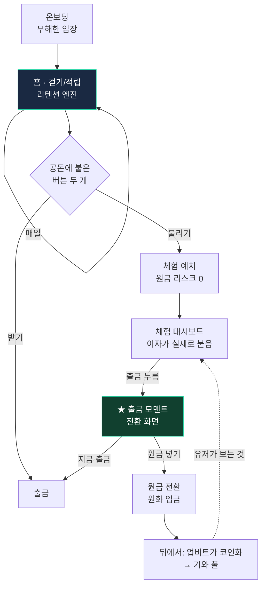

# Naduri — 프런트엔드 유저 플로우 (v0)

> 출처: 내부 Google Docs `Naduri_유저플로우.md` (2026-07-22 통합)
> 대상: 디자이너 + FE 개발자
> 목적: 화면 흐름과 각 화면의 "왜"를 한눈에.

## 핵심 원칙

**걷기 하러 온 사람에게 디파이를 들이밀면 튕긴다. 노출 → 체험 → 전환, 3층으로 스며들게 한다.**

## 전체 흐름

## 화면별 스펙

### 0. 온보딩
- 최소 단계. **걷기 권한(만보 센서)만** 받고 시작. 크립토·지갑·투자 언급 최소화.
- 목적: 손실 회피 대중을 경계 없이 입장시키는 **무해한 문**. 여기서 이질감이 튀면 다 잃는다.

### 1. 홈 · 걷기/적립 (리텐션 엔진)
- 오늘 걸음 수, 오늘 적립된 공돈. 매일 자정 리셋되는 **데일리 액션(상자 탭 등)**. 금액이 아니라 이 **루프가 훅**.
- 적립된 공돈 옆에 버튼 두 개 상시 노출: **[받기]** 와 **[불리기]**.
- 설명 없이 매일 보이는 것만으로 "여기선 불릴 수 있구나"가 무의식에 각인 (= **1층 노출**).
- 이 단계에선 **퍼센트·풀·코인명 같은 디테일 절대 노출 금지**. 버튼 하나, 단어 하나.

### 2. 체험 예치 (원금 리스크 0)
- **[불리기] 누른 사람만 진입** (= 2층 체험).
- 공돈을 "체험 예치"에 넣으면 스테이블 풀에 들어간 것처럼 보이고 이자가 붙기 시작.
- 이 이자는 실제 디파이 수익률을 반영하되 **파일럿에선 우리(광고/지원금 재원)가 지급**. 유저 원금은 리스크에 안 닿는다. (자동차 시승)

### 3. 체험 대시보드
- 넣은 공돈에 **매일 이자가 실제로 붙는 걸** 보여준다. **입금 → 이자 → 출금 루프**를 유저가 직접 완주할 수 있어야 한다.
- 리텐션 훅으로 "자산 성장 구경"은 약하다(하루 몇 원). 대신 **입금-이자-출금 루프를 실제로 겪는 경험 자체가 신뢰를 만든다.**

### 4. ★ 출금 모멘트 = 전환 화면 (심장)
- 유저가 출금 버튼을 누르는 골든 모멘트. 화면에 두 줄:
  - 지금 출금 — ₩20,000
  - 당신이 업비트에 놀리는 ₩3,000,000을 이 수익률로 뒀다면, **10년 후 약 ₩4,886,000** + *(현재 수익률 기준, 변동 가능)*
- 출금은 **원탭으로 진짜 열려 있다. 막지 않는다.** 강요가 아니라 제안.
- idle 잔고로 개인화(연동 전엔 고정 예시). 병목이 리스크가 아니라 "금액"임을 **산수가 스스로 밀게** 한다.

### 5. 원금 전환
- "더 벌려면 내 돈." 원화 입금 → (뒤에서 업비트가 코인화 → 기와 풀).
- 유저는 "원화 넣었더니 이자 붙네"만 경험한다. **스왑·가스·지갑·시드문구는 전부 뒤에서, 유저 눈앞에서 지운다.**

## 상태 · 규칙 요약 (FE가 놓치면 안 되는 것)

- 출금 경로는 **항상 3탭 이내**, 확인 다이얼로그로 마찰 주지 말 것.
- **확정 수익률 문구 금지.** 미래 가치는 항상 **가정형 + "변동 가능" 꼬리표.**
- 체험(2층)과 전환(5층)의 크레딧/포인트는 성격이 다르다: 체험은 "가짜 원금+진짜 수익 감각", 전환은 "진짜 원금(원화 입금)". **크레딧으로 코인을 사게 만들지 않는다.**
- **-EV 뽑기·"출금하려면 입금하세요" 류 인질형 UX 금지.**

## 지금은 만들지 않는 것 (deferred)

- **idle 잔고 개인화(실데이터)**: 두나무 계정 연동(파트너십) 후. 그전엔 고정 예시(예: ₩3,000,000)로 화면만 완성.
- **실제 온체인 풀 연결**: 메인넷 + 기와 위 유동성 프로토콜이 깔린 뒤. 파일럿은 **오프체인 포인트 + 시뮬레이션 이자**로 흐름만 증명.

## 연결 문서

- 정직성/법적 리스크 원칙은 [06-product-방향성](./06-product-방향성.md#️-반드시-지킬-것--정직성--법적-리스크) 와 정합 — "확정 수익률 금지 / 변동 가능 꼬리표"는 여기서도 동일 규칙.
